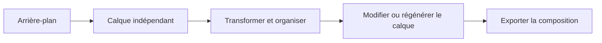

# Imagen Construct

> Un éditeur d’images open source et local-first dans lequel les éléments générés ou importés restent des calques indépendants et modifiables.

[English](README.md) · [Installation](docs/development/GETTING_STARTED.md) · [MVP](docs/MVP.md) · [Architecture](docs/ARCHITECTURE.md) · [Feuille de route](ROADMAP.md)

## État actuel

**MVP 0 — éditeur d’interaction implémenté et validé par la CI.**

L’application peut maintenant créer des projets locaux, importer des images PNG/WebP comme calques indépendants, les manipuler sans détruire les autres éléments, sauvegarder/rouvrir le projet et exporter la composition visible en PNG. La génération d’images réelle n’est pas encore connectée : la prochaine étape est un adaptateur de génération factice et déterministe.

## Fonctionnalités disponibles

- interface desktop conforme à la structure validée : haut, outils à gauche, canvas central, inspecteur à droite et panneau inférieur ;
- création de projet et persistance dans un `project.json` versionné ;
- images stockées comme fichiers ordinaires dans `assets/` ;
- import, sélection, déplacement, redimensionnement, rotation et réorganisation des calques ;
- visibilité, verrouillage, opacité, renommage, duplication et suppression ;
- Undo et Redo ;
- onglets `Layers`, `Properties` et `History` ;
- zoom, déplacement de la vue et ajustement du canvas ;
- export PNG aplati ;
- validation des imports PNG/WebP, checksum et écritures atomiques ;
- tests frontend, backend et navigateur Playwright dans GitHub Actions.

## Lancer le projet

```bash
git clone https://github.com/Kiingsora/imagen-construct.git
cd imagen-construct
git switch feat/mvp0-editor

corepack enable
corepack prepare pnpm@10.15.0 --activate
pnpm install --frozen-lockfile
uv --directory services/generation sync --frozen --dev
```

Dans deux terminaux :

```bash
pnpm dev:api
```

```bash
pnpm dev:editor
```

Ouvrir `http://127.0.0.1:5173`. Les instructions détaillées pour Windows, Linux, macOS, la configuration et les tests se trouvent dans [Getting started](docs/development/GETTING_STARTED.md).

## Principe du produit

Le **calque** est l’unité fondamentale de création :

1. générer ou importer un arrière-plan ;
2. ajouter des éléments indépendants ;
3. les déplacer, redimensionner, tourner, masquer, réordonner ou supprimer ;
4. modifier ou régénérer uniquement le calque sélectionné ;
5. exporter la composition sans reconstruire toute la scène.



## Architecture

- **Éditeur :** React, TypeScript, Vite, Konva et Zustand.
- **Noyau :** commandes, historique, migrations et logique des calques indépendants de l’interface.
- **Contrats :** schéma de projet versionné et validation à l’exécution.
- **Service local :** FastAPI, Pydantic, stockage atomique et future orchestration des générations.
- **Génération :** adaptateurs déclarant leurs capacités ; aucun code ComfyUI dans l’éditeur.

## Sécurité et persistance

- L’API écoute uniquement sur `127.0.0.1` par défaut.
- Les identifiants et noms de ressources sont limités.
- Les manifestes sont validés avant sauvegarde et après chargement.
- Les chemins d’images doivent rester sous `assets/`.
- Les images sont décodées, limitées en taille, vérifiées et écrites atomiquement.
- Les poids de modèles, secrets et projets utilisateur ne sont pas ajoutés au dépôt.

## Prochaine étape

Le début du MVP 1 utilisera un **adaptateur factice déterministe** pour ajouter :

- des requêtes prompt → calque ;
- une file de travaux sérialisée ;
- les états en attente, en cours, terminé, échoué et annulé ;
- une progression visible ;
- l’annulation et la régénération sélective sécurisée ;
- un fonctionnement complet sans GPU ni ComfyUI.

Un seul pipeline de génération réelle sera connecté après la validation de ce workflow.

## Contribution

Lire [CONTRIBUTING.md](CONTRIBUTING.md), [l’architecture](docs/ARCHITECTURE.md) et le [backlog initial](docs/INITIAL_BACKLOG.md) avant toute modification structurelle.

## Avertissement sur le nom

`imagen-construct` est un nom de travail. Le projet est indépendant et sans affiliation avec Google ou la famille de modèles Google Imagen. Le nom pourra être revu avant une version stable.

## Licence

Apache License 2.0. Les modèles et workflows connectés conservent leurs propres licences. Voir [LICENSE](LICENSE) et [MODEL_LICENSES.md](MODEL_LICENSES.md).
