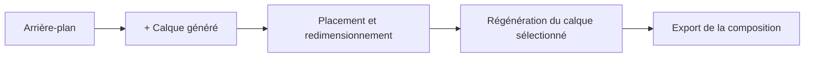
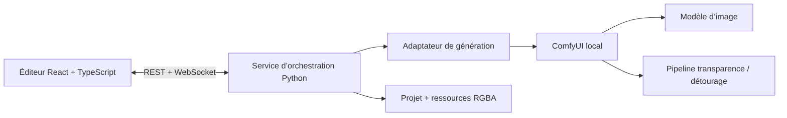

# Imagen Construct

> Un éditeur d’images génératives open source et local-first dans lequel chaque élément généré devient un calque indépendant et modifiable.

[English](README.md) · [Cadrage du projet](PROJECT_BRIEF.md) · [MVP](docs/MVP.md) · [Architecture](docs/ARCHITECTURE.md) · [Rapport de conception](docs/CONCEPTION.fr.md) · [Feuille de route](ROADMAP.md)

## État du projet

**Concept et architecture / pré-alpha.** Le dépôt formalise actuellement le produit, le plus petit MVP crédible, la direction technique et l’organisation des contributions. Il ne contient pas encore d’éditeur utilisable.

## Le problème

La majorité des générateurs d’images produisent un résultat aplati. Lorsqu’un seul objet est mauvais, l’utilisateur doit souvent régénérer ou repeindre une partie beaucoup plus large de l’image. Les petites corrections deviennent lentes, imprévisibles et destructrices.

## La proposition

Imagen Construct considère le **calque** comme l’unité fondamentale de génération.

1. Générer ou importer un arrière-plan.
2. Ajouter un calque et décrire un élément.
3. Déplacer, redimensionner, tourner, masquer, réordonner ou supprimer cet élément.
4. Régénérer uniquement le calque sélectionné.
5. Exporter l’image composée sans reconstruire toute la scène.

La vision à long terme ajoute la régénération contextuelle, la profondeur, l’éclairage, la segmentation et des contrôles facultatifs de pose. Ces fonctions sont volontairement exclues du premier MVP.

## Plus petit MVP crédible

La première version utile doit proposer :

- un canevas 2D ;
- un panneau de calques ;
- un prompt par calque généré ;
- une génération locale via un seul adaptateur ;
- une sortie RGBA pour les objets générés ;
- déplacement, redimensionnement, rotation, réorganisation, masquage, verrouillage, duplication et suppression ;
- régénération du seul calque sélectionné ;
- sauvegarde et chargement d’un projet ;
- export PNG ;
- file de génération visible.

Le premier prototype d’interaction peut utiliser des PNG transparents préparés à l’avance avant de connecter un modèle. Voir [docs/MVP.md](docs/MVP.md).

## Principes du produit

- **Layer-first :** la génération crée des éléments éditables, pas seulement une image finale aplatie.
- **Non destructif :** modifier un calque ne doit pas réécrire silencieusement les autres.
- **Local-first :** l’implémentation de référence doit fonctionner sans API payante.
- **Agnostique au modèle :** les modèles sont reliés par des adaptateurs.
- **Complexité progressive :** usage simple par défaut ; masques, profondeur et pose restent facultatifs.
- **Formats ouverts :** les projets restent inspectables et exportables.

## Direction technique initiale

Base recommandée :

- **Frontend :** React, TypeScript, Vite, Konva, Zustand.
- **Orchestration locale :** Python et FastAPI.
- **Backend de génération :** ComfyUI via ses API HTTP et WebSocket.
- **Premier chemin vers la transparence :** LayerDiffuse avec SDXL, ou générateur générique suivi d’un modèle de détourage.
- **Stockage :** manifeste JSON versionné et ressources RGBA locales.

## Pourquoi l’open source

Le projet n’a pas besoin de battre financièrement les grands acteurs. Sa valeur défendable est un workflow ouvert qui peut rester :

- gratuit à inspecter et modifier ;
- utilisable localement ;
- indépendant d’un fournisseur unique ;
- extensible par des adaptateurs et workflows communautaires ;
- utile même si les outils commerciaux ajoutent des fonctions semblables.

## Contribution

À ce stade, les contributions les plus utiles sont les critiques produit, prototypes UX, expérimentations de modèles, revues d’architecture et petits adaptateurs de preuve de concept. Lire [CONTRIBUTING.md](CONTRIBUTING.md) et le [backlog initial](docs/INITIAL_BACKLOG.md).

## Avertissement sur le nom

`imagen-construct` est un nom de travail. Le projet est indépendant et sans affiliation avec Google ou la famille de modèles Google Imagen. Le nom pourra être revu avant une version stable pour réduire les risques de confusion et de référencement.

## Licence

Apache License 2.0. Voir [LICENSE](LICENSE) et [MODEL_LICENSES.md](MODEL_LICENSES.md).
