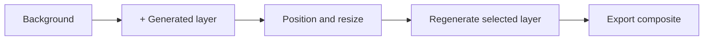
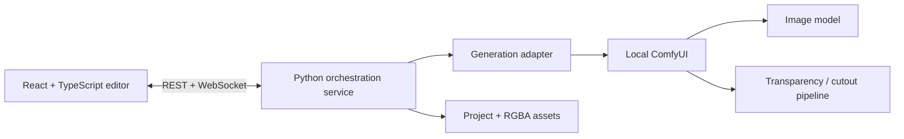

# Imagen Construct

> An open-source, local-first generative image editor where every generated element becomes an independent, editable layer.

[Français](README.fr.md) · [Project brief](PROJECT_BRIEF.md) · [MVP](docs/MVP.md) · [Architecture](docs/ARCHITECTURE.md) · [Design report (FR)](docs/CONCEPTION.fr.md) · [Roadmap](ROADMAP.md)

## Status

**Concept and architecture / pre-alpha.** The repository currently defines the product, the smallest credible MVP, the technical direction, and the contribution structure. It does not contain a usable editor yet.

## The problem

Most AI image generators produce a flattened result. When one object is wrong, users often have to regenerate or repaint a much larger part of the image. That makes small corrections slow, unpredictable, and destructive.

## The proposition

Imagen Construct treats the **layer** as the fundamental unit of generation.

1. Generate or import a background.
2. Add a layer and describe one element.
3. Move, scale, rotate, hide, reorder, or delete that element.
4. Regenerate only the selected layer.
5. Export the composed image without rebuilding the whole scene.



The long-term vision adds context-aware regeneration, depth, lighting, segmentation, and optional pose controls. Those features are explicitly outside the first MVP.

## Smallest credible MVP

The first usable version must provide:

- a 2D canvas;
- a layer panel;
- one prompt per generated layer;
- local generation through one adapter;
- RGBA output for generated objects;
- move, resize, rotate, reorder, hide, lock, duplicate, and delete;
- regeneration of only the selected layer;
- save/load of a project;
- PNG export;
- a visible generation queue.

The first interaction prototype may use prepared transparent PNG files before any AI model is connected. See [docs/MVP.md](docs/MVP.md).

## Product principles

- **Layer-first:** generation creates editable scene elements, not a final flattened image.
- **Non-destructive:** changes to one layer should not silently rewrite the others.
- **Local-first:** the reference implementation must run without a paid API.
- **Model-agnostic:** models are connected through adapters rather than embedded into the editor.
- **Progressive complexity:** simple by default; masks, depth, pose, and advanced controls are optional.
- **Open formats:** projects should remain inspectable and exportable.

## Initial technical direction



The proposed baseline is:

- **Frontend:** React, TypeScript, Vite, Konva, Zustand.
- **Local orchestration:** Python and FastAPI.
- **Generation backend:** ComfyUI through its HTTP and WebSocket server API.
- **First transparency path:** LayerDiffuse with SDXL, or a generic generator followed by a cutout model.
- **Project storage:** a versioned JSON manifest plus local RGBA assets.

This is a recommendation, not a frozen implementation contract. Details are documented in [docs/ARCHITECTURE.md](docs/ARCHITECTURE.md).

## Why open source

The project is not intended to outspend major image-generation companies. Its defensible value is an open workflow that can remain:

- free to inspect and modify;
- usable locally;
- independent from one model vendor;
- extensible through community adapters and workflows;
- useful even when commercial tools add similar features.

## Repository layout

```text
imagen-construct/
├── apps/editor/              # Future web editor
├── services/generation/      # Future local orchestration service
├── packages/core/            # Shared scene and layer domain model
├── workflows/comfyui/        # Versioned generation workflows
├── docs/                     # Product and technical documentation
├── examples/                 # Future sample projects
└── .github/                  # Contribution templates and checks
```

## Current decisions

- The first platform is desktop, delivered initially as a local web application.
- Mobile is deferred until the desktop workflow is validated.
- No model weights are committed to this repository.
- The repository code is licensed under Apache License 2.0; connected models retain their own licenses.

## Contributing

The most useful contributions at this stage are product critique, UX prototypes, model experiments, architecture review, and small proof-of-concept adapters. Read [CONTRIBUTING.md](CONTRIBUTING.md) and the [initial backlog](docs/INITIAL_BACKLOG.md) before opening a pull request.

## Independence notice

`imagen-construct` is a working project name. This independent project is not affiliated with Google or the Google Imagen family of models. The name may be revisited before a stable release to reduce trademark and search-discoverability risk.

## License

Apache License 2.0. See [LICENSE](LICENSE) and [MODEL_LICENSES.md](MODEL_LICENSES.md).
