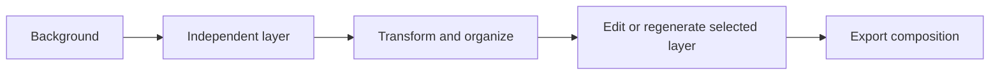
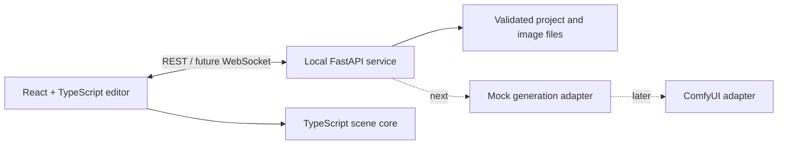

# Imagen Construct

> An open-source, local-first image editor where generated or imported elements remain independent, editable layers.

[Français](README.fr.md) · [Getting started](docs/development/GETTING_STARTED.md) · [MVP](docs/MVP.md) · [Architecture](docs/ARCHITECTURE.md) · [Roadmap](ROADMAP.md)

## Status

**MVP 0 — interaction editor implemented and validated in CI.**

The current application can create local projects, import PNG/WebP assets as independent layers, manipulate them non-destructively, save/reopen the project, and export the visible composition as PNG. Real image generation is not connected yet; the next milestone is a deterministic mock generation adapter.

## What works now

- desktop editor following the approved top/left/center/right/bottom workspace structure;
- project creation and versioned `project.json` persistence;
- normal image files under each project's `assets/` directory;
- layer import, selection, move, resize, rotation, ordering, visibility, locking, opacity, rename, duplication, and deletion;
- Undo and Redo;
- `Layers`, `Properties`, and `History` inspector tabs;
- canvas zoom, pan, and fit controls;
- flattened PNG export;
- validated PNG/WebP uploads with atomic writes and checksums;
- frontend, backend, and Playwright end-to-end checks in GitHub Actions.

## Run locally

```bash
git clone https://github.com/Kiingsora/imagen-construct.git
cd imagen-construct
git switch feat/mvp0-editor

corepack enable
corepack prepare pnpm@10.15.0 --activate
pnpm install --frozen-lockfile
uv --directory services/generation sync --frozen --dev
```

Start the API and editor in two terminals:

```bash
pnpm dev:api
```

```bash
pnpm dev:editor
```

Open `http://127.0.0.1:5173`. Detailed Windows, Linux, macOS, configuration, and test instructions are in [Getting started](docs/development/GETTING_STARTED.md).

## Product model

Imagen Construct treats the **layer** as the fundamental unit of creation:

1. generate or import a background;
2. add independent visual elements;
3. move, scale, rotate, hide, reorder, or delete them;
4. edit or regenerate only the selected layer;
5. export the composition without rebuilding the entire scene.



## Architecture



- **Editor:** React, TypeScript, Vite, Konva, Zustand.
- **Core:** model-independent TypeScript project, layer, command, migration, and history logic.
- **Contracts:** versioned project schema and runtime validation.
- **Local service:** FastAPI, Pydantic, atomic storage, and future generation orchestration.
- **Generation:** capability-aware adapters; ComfyUI remains outside the editor.

## Repository layout

```text
imagen-construct/
├── apps/editor/                 # React/Konva editor
├── packages/core/               # Scene commands and history
├── packages/contracts/          # Project contracts and schemas
├── services/generation/         # Local FastAPI service
├── workflows/comfyui/           # Future versioned workflows
├── examples/                    # Fixtures and sample projects
└── docs/                        # Product, UX, and architecture documents
```

## Safety and persistence

- The API binds to `127.0.0.1` by default.
- Project identifiers and asset names are constrained.
- Project manifests are validated before saving and after loading.
- Asset paths must remain under `assets/`.
- PNG/WebP uploads are decoded, dimension-limited, checksummed, and written atomically.
- Model weights, secrets, and generated user projects are excluded from Git.

## Next milestone

MVP 1 begins with a **deterministic mock adapter**, not a real model. That milestone will add:

- prompt-to-layer requests;
- a serialized job queue;
- queued/running/completed/failed/cancelled states;
- progress events;
- cancellation and safe selective regeneration;
- complete operation without GPU or ComfyUI.

Only after that workflow is stable will the project connect one real transparent-generation pipeline.

## Contributing

Read [CONTRIBUTING.md](CONTRIBUTING.md), the [architecture](docs/ARCHITECTURE.md), and the [initial backlog](docs/INITIAL_BACKLOG.md) before making structural changes.

## Independence notice

`imagen-construct` is a working project name. This independent project is not affiliated with Google or the Google Imagen family of models. The name may be revisited before a stable release.

## License

Apache License 2.0. Connected models and workflows retain their own licenses. See [LICENSE](LICENSE) and [MODEL_LICENSES.md](MODEL_LICENSES.md).
