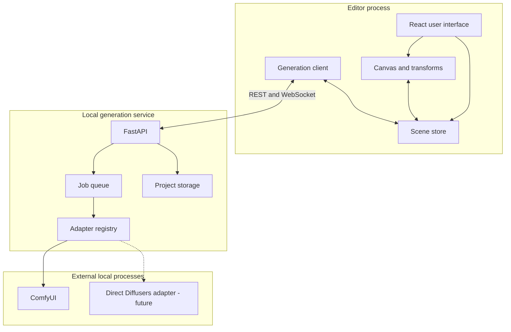
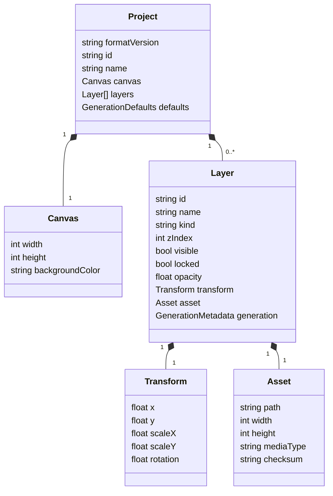
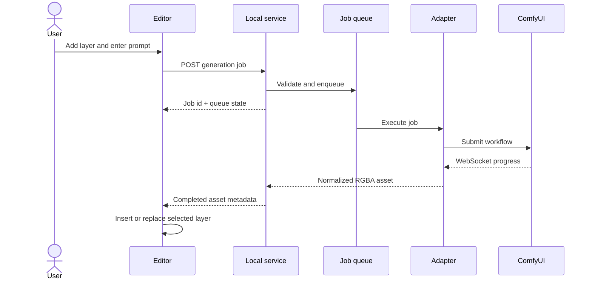

# Proposed Architecture

## Architectural goal

Keep the editor independent from any single image model or inference application. The UI should manipulate scene state; generation backends should produce or modify assets through adapters.

## Baseline stack

| Layer | Recommendation | Reason |
| --- | --- | --- |
| Editor | React + TypeScript + Vite | Fast iteration and a familiar web stack |
| Canvas | Konva through react-konva | Built-in transforms, hit testing, grouping, and canvas export |
| State | Zustand | Small state layer with predictable actions and low ceremony |
| Local API | FastAPI + Pydantic | Strong fit for Python model tooling and typed request validation |
| Generation | ComfyUI adapter | Reuses local workflows, queueing, models, and community nodes |
| Transport | HTTP for commands, WebSocket for progress | Matches ComfyUI server capabilities and keeps progress responsive |
| Storage | JSON manifest plus ordinary image files | Inspectable, versionable, and recoverable |
| Packaging | Local web app first; desktop wrapper later | Avoids adding Tauri/Electron complexity before product validation |

The selected libraries are recommendations for the first implementation, not permanent project constraints.

## Component view



## Responsibilities

### Editor

The editor owns:

- visual composition;
- selection and transforms;
- layer ordering and visibility;
- undoable editor actions;
- local project state;
- prompt editing;
- presentation of generation state.

The editor does **not** load model weights or implement model-specific preprocessing.

### Generation service

The local Python service owns:

- adapter discovery;
- model and workflow capability reporting;
- job validation and serialization;
- communication with ComfyUI or another backend;
- asset normalization;
- progress and error events;
- project asset writes using atomic replacement.

### Generation adapter

Each adapter translates a model-agnostic request into a backend-specific workflow.

Conceptual interface:

```python
class GenerationAdapter(Protocol):
    id: str

    async def capabilities(self) -> AdapterCapabilities: ...
    async def generate_layer(self, request: GenerateLayerRequest) -> GeneratedAsset: ...
    async def edit_layer(self, request: EditLayerRequest) -> GeneratedAsset: ...
    async def cancel(self, job_id: str) -> None: ...
```

The first adapter should expose only implemented capabilities. The UI must not show an edit, mask, or depth control when the active adapter cannot perform it.

## Scene data model



The canonical draft schema is in [schemas/project.schema.json](schemas/project.schema.json).

## Project format

During development, a project is a directory:

```text
my-scene/
├── project.json
├── assets/
│   ├── layer-background.png
│   ├── layer-sofa-v001.png
│   └── layer-character-v002.png
├── masks/
└── previews/
```

A future `.imagen` file can be a ZIP container with the same structure. The manifest must include a format version so migrations are possible.

## Generation flow



## Queue strategy

The reference implementation should use a single GPU job lane by default.

- Editor operations remain immediate.
- Generation requests are queued.
- A small preview job may have higher priority than a final render.
- The previous layer asset remains active until replacement succeeds.
- Cancellation is best effort and must not corrupt project state.
- Future multi-GPU or remote workers can add lanes without changing the scene model.

This creates responsive UX without pretending that multiple large models run simultaneously on one consumer GPU.

## Transparency strategy

Adapters return premultiplied or straight-alpha RGBA assets according to one documented convention. The service normalizes output before the editor receives it.

Two initial strategies are supported conceptually:

1. **Native alpha generation:** LayerDiffuse with an SDXL-compatible workflow.
2. **Post-generation cutout:** generate an isolated object, then derive alpha with a cutout/segmentation model.

The second approach is more model-agnostic but may produce poorer edges, holes, glass, smoke, hair, and shadows.

## Context-aware regeneration

Not part of the MVP. A later request may contain:

- the selected layer;
- a low-resolution composite;
- a protected-region mask;
- an optional spatial bounding box;
- optional depth and lighting hints.

The product must distinguish two operations:

- **Fast transform:** move/scale the existing RGBA asset instantly.
- **Contextual regenerate:** spend GPU time to adapt perspective, occlusion, lighting, or shadows.

The application must never imply that a simple transform has physically re-rendered the scene.

## Persistence and safety

- Write generated files to a temporary path first.
- Verify the image can be decoded.
- Compute a checksum.
- Update the manifest only after the asset is valid.
- Keep the previous asset until the transaction succeeds.
- Autosave scene metadata separately from large generated files.
- Never store API keys or external credentials inside project files.

## API sketch

```text
GET    /health
GET    /v1/adapters
GET    /v1/adapters/{id}/capabilities
POST   /v1/projects
GET    /v1/projects/{id}
PUT    /v1/projects/{id}
POST   /v1/jobs/generate-layer
POST   /v1/jobs/edit-layer
POST   /v1/jobs/{id}/cancel
GET    /v1/jobs/{id}
WS     /v1/events
```

The exact API should be generated from an OpenAPI contract after implementation begins.

## Repository modules

```text
apps/editor/
  React application and canvas UI

packages/core/
  TypeScript scene types, commands, migrations, and validation

services/generation/
  Python API, queue, adapters, and asset processing

workflows/comfyui/
  Versioned workflow JSON and adapter-specific documentation

examples/
  Small projects and test fixtures without restricted model weights
```

## Testing strategy

- Unit tests for scene commands and migrations.
- Golden-image tests for canvas composition.
- Contract tests for adapters using deterministic fixtures.
- Integration tests against a mock ComfyUI server.
- Optional hardware tests for real workflows.
- Manual UX test based on the four-layer reference scene.

## Deployment boundary

MVP development runs as two local processes:

1. the web editor;
2. the Python generation service, which talks to ComfyUI.

Only after this boundary is stable should the project evaluate a desktop wrapper or one-click installer.
