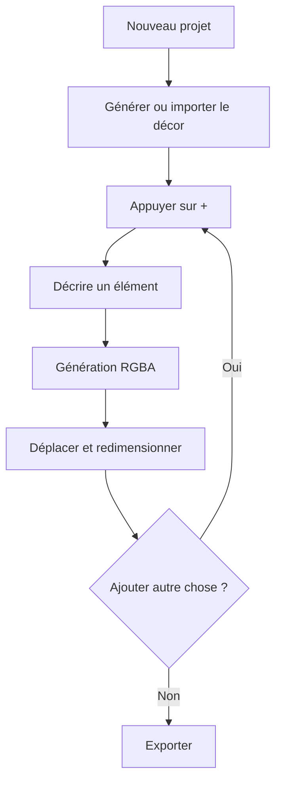

# Rapport de conception initiale — Imagen Construct

**Version :** 0.1
**Date :** 27 août 2026
**État :** document de cadrage vivant, avant prototype
**Dépôt prévu :** `Kiingsora/imagen-construct`

---

## Résumé exécutif

Imagen Construct est un projet d’éditeur d’images génératives open source dans lequel chaque élément créé par l’intelligence artificielle devient un **calque indépendant**. L’utilisateur ne construit plus uniquement une image à partir d’un long prompt global : il construit une scène progressivement, élément par élément, avec la possibilité de déplacer, redimensionner, masquer, supprimer, réordonner ou régénérer chaque partie sans refaire toute l’image.

La proposition de valeur peut être résumée ainsi :

> **Construire l’image élément par élément et ne modifier que ce qui ne convient pas.**

L’idée répond à un problème réel : les générateurs d’images produisent souvent un résultat visuellement convaincant mais difficile à corriger précisément. Une modification mineure peut entraîner la régénération d’une grande zone, modifier des éléments satisfaisants ou obliger l’utilisateur à recommencer plusieurs fois.

Le principe des images décomposées en couches n’est toutefois plus inédit. Des projets comme Qwen-Image-Layered savent décomposer une image en plusieurs couches RGBA, LayerDiffuse génère des images transparentes et Krita AI Diffusion combine déjà calques, régions, masques et workflows ComfyUI. La pertinence d’Imagen Construct ne dépend donc pas de l’affirmation « l’IA peut produire des calques ». Elle dépend de la qualité d’un **workflow layer-first**, pensé dès le départ autour d’éléments génératifs indépendants.

Le produit complet imaginé — perspective, profondeur, ombres, interactions entre objets, mannequin de pose et adaptation dynamique après déplacement — est techniquement ambitieux. En revanche, un premier produit réellement testable est faisable : un canevas, un panneau de calques, un prompt par calque, une génération locale transparente, des transformations 2D et la régénération du seul calque sélectionné.

La recommandation est donc de ne pas tenter de créer immédiatement un « Photoshop IA ». Il faut d’abord répondre à une question plus limitée :

> **Le fait de générer une scène par calques indépendants rend-il la création plus contrôlable et plus agréable qu’une succession de régénérations d’image complète ?**

Le projet est particulièrement cohérent en open source. Les grands acteurs peuvent proposer des fonctions proches, mais une alternative ouverte peut conserver des avantages durables : exécution locale, indépendance vis-à-vis d’un fournisseur, intégration de plusieurs modèles, confidentialité et capacité de la communauté à expérimenter.

---

## 1. Origine du concept

Le concept part d’une expérience d’usage fréquente avec les générateurs d’images : l’utilisateur sait globalement ce qu’il veut, mais il ne veut pas forcément tout décrire dans un seul prompt ni accepter que l’image finale soit figée.

Exemple de scène :

1. une pièce vide en contre-plongée ;
2. un canapé ;
3. un personnage ;
4. une table placée devant lui ;
5. quelques objets de décoration ;
6. des effets de lumière.

Dans un générateur classique, l’utilisateur peut tenter de tout décrire en une seule fois. Il obtient parfois un résultat proche, mais le canapé peut être mal placé, le personnage peut avoir une mauvaise posture ou la table peut masquer une partie importante de la scène. Une correction locale est possible dans certains outils, mais elle repose généralement sur l’inpainting d’une image aplatie.

Dans Imagen Construct, chaque demande crée une entité durable :

```text
Calque 4 — Table
Calque 3 — Personnage
Calque 2 — Canapé
Calque 1 — Décor
```

Chaque calque conserve son propre contenu, ses transformations et ses métadonnées de génération. Le résultat final reste une composition, pas seulement une image aplatie.

Cette structure permet plusieurs actions immédiates :

- déplacer le canapé sans modifier le décor ;
- supprimer la table ;
- passer le personnage derrière un autre élément ;
- changer la couleur d’un objet en régénérant seulement son calque ;
- revenir à une ancienne version de l’objet ;
- réutiliser un élément dans une autre composition ;
- exporter l’image finale tout en conservant le projet éditable.

---

## 2. Évaluation honnête de l’idée

### 2.1 Le problème est pertinent

Le manque de contrôle local est l’une des limites les plus visibles de la génération d’images. Les fonctions d’inpainting, de sélection, de référence et d’édition par instruction améliorent la situation, mais elles ne transforment pas automatiquement les éléments de l’image en objets indépendants.

Le besoin est particulièrement fort dans les usages où les retours sont nombreux :

- illustration commandée ;
- contenu pour réseaux sociaux ;
- visuels de jeu ou de visual novel ;
- maquettes publicitaires ;
- storyboard ;
- concept art ;
- communication d’agence.

Un client qui demande « garde tout, mais change seulement la table » expose exactement le problème que le projet cherche à résoudre.

### 2.2 La technologie des calques IA existe déjà en partie

Qwen-Image-Layered décompose une image existante en plusieurs couches RGBA manipulables. Le projet officiel insiste sur le déplacement, le redimensionnement, la recoloration et la décomposition récursive. Cependant, les auteurs précisent aussi que les poids publiés sont spécialisés dans la décomposition image-vers-couches et que la génération texte-vers-plusieurs-couches reste limitée. Ce modèle est donc une brique potentielle pour l’import et la décomposition, pas une solution complète au workflow envisagé.

LayerDiffuse permet de produire directement des images transparentes à partir de SDXL. Son implémentation Diffusers officielle est annoncée comme un travail en cours, mais elle fournit déjà du text-to-image et de l’image-to-image transparents. Le dépôt indique qu’une configuration NVIDIA disposant de 8 Go de VRAM peut exécuter la démonstration, ce qui en fait une piste crédible pour une preuve de concept locale.

Krita AI Diffusion fournit déjà des générations locales, des sélections, des régions associées à des calques, des calques de contrôle et une connexion à ComfyUI. Cela démontre qu’un workflow artistique local et intégré est demandé, mais cela signifie aussi qu’Imagen Construct doit avoir une différence claire : le calque génératif ne doit pas être une fonction ajoutée à un éditeur généraliste ; il doit être le modèle mental principal du produit.

### 2.3 Ce qui peut différencier le projet

L’originalité défendable ne serait pas :

> « Nous sommes capables de produire une image transparente. »

Elle serait plutôt :

> « Chaque génération devient un objet de scène indépendant, persistant, versionné et régénérable. »

Les différences potentielles sont les suivantes :

- bouton `+` créant naturellement un nouveau calque génératif ;
- prompt et historique attachés à chaque calque ;
- génération progressive de scène ;
- séparation claire entre transformation instantanée et régénération contextuelle ;
- file de génération visible et compréhensible ;
- format de projet ouvert ;
- adaptateurs interchangeables pour plusieurs modèles ;
- fonctionnement local sans abonnement obligatoire ;
- interface plus simple qu’un logiciel professionnel généraliste.

### 2.4 Le projet complet reste difficile

Déplacer un PNG est simple. Déplacer un objet et recalculer automatiquement sa taille apparente, son occlusion, son éclairage, son reflet et son ombre relève d’un système de représentation de scène plus avancé.

La vision complète contient au moins cinq problèmes distincts :

1. génération ou extraction d’un objet RGBA propre ;
2. composition et transformations 2D ;
3. compréhension de la profondeur et de la perspective ;
4. harmonisation de l’éclairage et des couleurs ;
5. régénération contrôlée sans modifier les zones protégées.

Il faut donc construire le produit par paliers et ne pas présenter les fonctionnalités futures comme déjà résolues.

---

## 3. Définition du produit

### 3.1 Phrase de définition

**Imagen Construct est un éditeur d’images génératives open source et local-first dans lequel chaque élément généré est conservé comme un calque indépendant, transformable et régénérable sans reconstruire l’image complète.**

### 3.2 Promesse utilisateur

> **Compose, déplace et corrige chaque élément séparément.**

### 3.3 Positionnement

Le projet se situe à l’intersection de plusieurs familles d’outils :

- éditeur de calques comme Photoshop ou Krita ;
- générateur d’images ;
- outil de composition 2D ;
- orchestrateur local de workflows IA ;
- éditeur de scène 2,5D à long terme.

Il ne doit pas essayer de remplacer chacun de ces outils. Sa force est une expérience centrée sur la composition générative.

### 3.4 Ce que le projet n’est pas

Le projet n’est pas, dans sa première phase :

- un éditeur photo complet ;
- un outil de peinture numérique ;
- un logiciel 3D ;
- un service cloud de génération ;
- un nouveau modèle fondation ;
- une garantie de cohérence physique après chaque déplacement ;
- une application mobile complète ;
- un système de collaboration temps réel.

Limiter explicitement le périmètre protège le projet contre l’accumulation de fonctionnalités.

---

## 4. Utilisateurs visés

### 4.1 Créateurs non spécialistes

Ils veulent obtenir un résultat précis sans maîtriser les prompts complexes, les masques ou les graphes ComfyUI. Ils doivent pouvoir :

- ajouter un élément ;
- le déplacer ;
- demander une modification simple ;
- revenir en arrière ;
- exporter.

L’interface doit masquer la majorité des paramètres techniques par défaut.

### 4.2 Créateurs de contenu et petites agences

Ils réalisent de nombreuses variations et reçoivent des demandes de correction. Leur intérêt principal est le gain de temps et la préservation des éléments validés.

### 4.3 Illustrateurs, graphistes et concept artists

Ils ont besoin de davantage de contrôle : masques, références, seeds, modèles, tailles, versions, calques verrouillés et éventuellement intégration avec leurs outils existants.

### 4.4 Développeurs et chercheurs open source

Ils peuvent contribuer des adaptateurs, des workflows de transparence, de segmentation, de profondeur ou d’harmonisation.

### 4.5 Équipes de jeux, visual novels et bandes dessinées

Elles peuvent utiliser le système pour composer des cases, arrière-plans, personnages et accessoires. La réutilisation des éléments et la cohérence entre variantes constituent un potentiel important, même si la cohérence multi-image n’appartient pas au premier MVP.

### 4.6 Grand public ou professionnels ?

Il n’est pas nécessaire de choisir un seul public immédiatement. La bonne approche est une interface à complexité progressive :

- mode simple : prompt, ajout, déplacement, régénération ;
- panneau avancé facultatif : modèle, seed, masque, contexte, workflow et paramètres.

Le MVP doit cependant privilégier un usage simple. Les fonctionnalités professionnelles ne doivent pas dégrader la lisibilité du parcours principal.

---

## 5. Parcours utilisateurs

### 5.1 Construction manuelle par calques

C’est le parcours fondamental.



L’utilisateur choisit la granularité. Un calque peut contenir un seul canapé ou un groupe complet de meubles. Le logiciel ne doit pas imposer qu’un calque corresponde toujours à un seul objet.

### 5.2 Génération globale puis décomposition

L’utilisateur décrit une scène complète. Le système produit d’abord une image globale, puis tente de la décomposer en couches. Qwen-Image-Layered est une piste pour cette fonction.

Ce parcours est utile pour démarrer rapidement, mais il doit rester secondaire au début, car la décomposition n’est pas toujours sémantiquement parfaite et peut créer des éléments partiellement fusionnés.

### 5.3 Modification d’un calque existant

L’utilisateur sélectionne le canapé et écrit : « même canapé, mais bleu foncé ». Le système crée une nouvelle version du fichier de ce calque, conserve l’ancienne version et ne remplace la référence active qu’après succès.

### 5.4 Import d’une image existante

L’utilisateur importe un PNG, JPEG ou WebP. Selon les capacités installées, il peut :

- l’utiliser comme calque aplati ;
- supprimer son fond ;
- sélectionner un objet par clic ou boîte ;
- demander une décomposition future en plusieurs calques.

### 5.5 Transformation rapide et régénération contextuelle

Le produit doit distinguer deux actions :

**Transformation rapide**

- instantanée ;
- applique position, échelle ou rotation à l’image existante ;
- ne recalcule pas l’éclairage ni la perspective.

**Régénération contextuelle**

- plus lente ;
- utilise éventuellement la composition, un masque, une profondeur ou une zone ;
- cherche à adapter l’objet à sa nouvelle position.

Cette distinction évite de promettre une adaptation « en temps réel » qui n’existe pas encore.

---

## 6. Principes de conception

### 6.1 Layer-first

Tout résultat généré doit pouvoir devenir un calque identifiable et durable. Le produit ne doit pas considérer la composition finale comme l’unique source de vérité.

### 6.2 Non destructif

Une opération ciblée ne doit pas détruire le contenu validé. Les anciennes versions peuvent être nettoyées manuellement, mais elles doivent rester disponibles tant que l’opération n’est pas confirmée.

### 6.3 Local-first

La référence du projet doit fonctionner sans abonnement ni API payante. Des adaptateurs cloud pourront être ajoutés ultérieurement, mais ils ne doivent pas être nécessaires au fonctionnement principal.

### 6.4 Agnostique au modèle

Les modèles évoluent rapidement. Le domaine du produit — projets, calques, transformations, historique — ne doit pas dépendre d’un checkpoint précis.

### 6.5 Complexité progressive

Les options techniques ne sont affichées que lorsqu’elles sont utiles. Le bouton principal reste : ajouter un calque, décrire, générer.

### 6.6 Formats ouverts

Les images générées restent des fichiers classiques. Le manifeste du projet est en JSON versionné. Un futur fichier `.imagen` peut être un conteneur ZIP inspectable.

### 6.7 Transparence des limites

L’application doit expliquer lorsqu’une opération n’est qu’une transformation 2D. Elle ne doit pas laisser croire qu’elle a recalculé la perspective ou l’éclairage si ce n’est pas le cas.

---

## 7. Définition du MVP

Le MVP est divisé en deux étapes pour éviter que les difficultés du modèle masquent un mauvais workflow.

### 7.1 MVP 0 — Interface sans IA

Le premier prototype utilise des PNG transparents préparés à l’avance.

Fonctions :

- canevas 2D ;
- zoom et déplacement du canevas ;
- ajout de calque ;
- sélection sur le canevas ou dans la liste ;
- déplacement, redimensionnement et rotation ;
- réorganisation ;
- masquage, verrouillage, duplication et suppression ;
- sauvegarde et chargement ;
- export PNG.

Ce prototype répond à une question : le système de composition est-il intuitif et agréable ?

### 7.2 MVP 1 — Première génération locale

Une fois l’interface validée, un seul adaptateur est connecté.

Fonctions supplémentaires :

- prompt attaché au calque ;
- génération RGBA locale ;
- file de tâches ;
- progression visible ;
- annulation ;
- régénération du seul calque sélectionné ;
- conservation du résultat précédent en cas d’échec ;
- stockage du modèle, workflow, seed et paramètres.

### 7.3 Scène de référence

Le test public du projet doit rester simple et immédiatement compréhensible :

1. générer un salon vide ;
2. ajouter un canapé ;
3. ajouter une personne ;
4. ajouter une table ;
5. déplacer le canapé ;
6. placer la table devant la personne ;
7. modifier uniquement la couleur du canapé ;
8. masquer la personne ;
9. exporter l’image.

### 7.4 Fonctions exclues

Le MVP n’inclut pas :

- profondeur automatique ;
- recalcul réaliste des ombres ;
- mannequin articulé ;
- génération réellement parallèle de plusieurs gros modèles ;
- mobile ;
- collaboration ;
- décomposition automatique complète ;
- export PSD fidèle ;
- entraînement d’un modèle propriétaire.

---

## 8. Interface envisagée

### 8.1 Organisation desktop

Une interface desktop peut utiliser quatre zones :

```text
┌──────────────────────────────────────────────────────────┐
│ Barre projet / export / annuler / refaire               │
├───────────────┬──────────────────────────┬───────────────┤
│ Outils        │                          │ Calques       │
│ sélection     │         Canevas          │               │
│ déplacement   │                          │ Décor         │
│ masque futur  │                          │ Canapé        │
│               │                          │ Personnage    │
├───────────────┴──────────────────────────┴───────────────┤
│ Prompt du calque sélectionné | Générer | File de tâches │
└──────────────────────────────────────────────────────────┘
```

Le prompt est lié au calque sélectionné. Appuyer sur `+` crée un nouveau calque, lui donne le focus et prépare le champ de génération.

### 8.2 Panneau de calques

Chaque ligne peut afficher :

- vignette ;
- nom ;
- visibilité ;
- verrouillage ;
- état de génération ;
- type : importé, généré, arrière-plan ;
- avertissement si le fichier manque.

Les paramètres avancés restent dans un panneau repliable.

### 8.3 Historique

Deux historiques distincts sont recommandés :

1. historique global des actions d’éditeur : déplacement, ordre, suppression ;
2. versions propres au calque : résultat v1, v2, v3.

Le second n’est pas obligatoire au tout premier prototype, mais le format de données ne doit pas l’empêcher.

### 8.4 File de génération

Sur une seule carte graphique, les grosses générations doivent être sérialisées. L’interface peut afficher plusieurs travaux en même temps, mais le moteur décide de leur ordre.

États :

```text
En attente → Préparation → Génération → Traitement alpha → Sauvegarde → Terminé
                                      ↘ Échec / Annulé
```

L’illusion d’un produit réactif vient de l’interface, des aperçus et de la progression, pas de la prétention que tout calcule simultanément.

### 8.5 Version mobile future

Le mobile est envisageable avec un canevas en paysage, un panneau de calques coulissant et un gros bouton `+`. Cependant, il doit être conçu après validation de l’expérience desktop. Le mobile simplifiera probablement les contrôles avancés plutôt que de reproduire toute l’interface.

---

## 9. Architecture technique proposée

### 9.1 Frontend

**React + TypeScript + Vite** conviennent à un prototype rapide et à un développeur web. **Konva** fournit les primitives utiles : scène, calques graphiques, sélection, transformations et export. **Zustand** peut gérer un état de scène sans architecture excessive.

Le frontend ne charge aucun modèle. Il gère uniquement la composition et les commandes utilisateur.

### 9.2 Service local Python

Un service **FastAPI** assure l’orchestration :

- validation des requêtes ;
- file de tâches ;
- registre des adaptateurs ;
- écriture atomique des ressources ;
- événements de progression ;
- communication avec ComfyUI.

Python est retenu car les outils de génération, segmentation et profondeur y sont majoritairement disponibles.

### 9.3 ComfyUI comme première couche d’inférence

ComfyUI fournit des routes HTTP et WebSocket documentées. Une requête peut être envoyée à `/prompt`, la file peut être consultée et les événements d’exécution sont transmis par `/ws`. Cela permet au projet de déléguer la gestion des modèles et workflows sans reproduire immédiatement tout un moteur d’inférence.

L’éditeur ne doit toutefois pas dépendre directement du format de graphe ComfyUI. L’adaptateur traduit les demandes du produit vers le workflow choisi.

### 9.4 Adaptateurs

Un adaptateur annonce ses capacités :

```json
{
  "generateTransparent": true,
  "editTransparent": true,
  "supportsMask": false,
  "supportsContext": false,
  "supportsSeed": true
}
```

L’interface affiche uniquement les contrôles compatibles.

### 9.5 Stockage

Un projet est d’abord un dossier :

```text
project.json
assets/
masks/
previews/
```

Chaque calque référence un fichier par chemin relatif et conserve un checksum. Une future extension `.imagen` regroupe le dossier sous forme d’archive ZIP.

### 9.6 Métadonnées minimales d’un calque

- identifiant stable ;
- nom ;
- type ;
- ordre ;
- visibilité et verrouillage ;
- opacité ;
- transformation ;
- chemin du fichier RGBA ;
- dimensions ;
- prompt positif et négatif ;
- seed ;
- adaptateur ;
- modèle ;
- workflow ;
- date de génération.

Le schéma préliminaire se trouve dans `docs/schemas/project.schema.json`.

---

## 10. Stratégie de génération et de transparence

### 10.1 Option A — LayerDiffuse avec SDXL

LayerDiffuse ajoute une représentation de transparence latente et fournit une implémentation officielle pour SDXL text-to-image et image-to-image.

**Avantages :**

- transparence produite nativement ;
- code Apache 2.0 ;
- démonstration annoncée pour 8 Go de VRAM ;
- adaptée à la création d’un objet directement en RGBA.

**Limites :**

- implémentation officielle encore décrite comme WIP ;
- dépendance à une famille de modèles plus ancienne ;
- qualité et cohérence à tester sur les cas réels ;
- détails complexes comme verre, fumée ou ombres restent difficiles.

**Usage recommandé :** première preuve de génération transparente si le workflow fonctionne de manière stable sur la machine cible.

### 10.2 Option B — Générateur générique puis détourage

Le système génère un objet isolé sur un fond simple, puis un modèle de segmentation ou de matting produit l’alpha. BiRefNet est une piste de segmentation dichotomique haute résolution ; SAM 2 peut aider à une sélection guidée par clic ou boîte.

**Avantages :**

- compatible avec plusieurs générateurs ;
- découplage entre qualité de génération et transparence ;
- remplacement facile d’un modèle.

**Limites :**

- bordures et détails fins parfois imparfaits ;
- l’ombre peut être supprimée ou mal isolée ;
- les objets transparents sont difficiles ;
- une correction manuelle peut être nécessaire.

**Usage recommandé :** solution de repli et base d’une architecture agnostique au modèle.

### 10.3 Option C — Qwen-Image-Layered pour la décomposition

Qwen-Image-Layered possède 20 milliards de paramètres et décompose une image en plusieurs couches RGBA. Il est très pertinent pour un futur parcours « importer/générer une image complète puis la rendre éditable ».

Il n’est pas recommandé comme premier backend :

- il vise principalement la décomposition ;
- la génération texte-vers-couches est annoncée comme limitée ;
- le modèle est lourd ;
- le pipeline complet n’est pas une base prudente pour une machine disposant de 16 Go de VRAM et 16 Go de RAM.

Il doit être traité comme un adaptateur expérimental futur, éventuellement quantifié, et non comme une dépendance centrale.

### 10.4 Générateur de décor

Le décor n’a pas besoin de transparence. Le projet peut accepter plusieurs modèles via ComfyUI. Pour le premier prototype, utiliser SDXL pour le décor et les objets peut réduire le nombre de modèles chargés et faciliter une cohérence stylistique minimale.

FLUX.1-schnell est sous Apache 2.0 et génère en un à quatre pas, mais sa carte officielle indique une utilisation mémoire élevée dans le pipeline de référence. Des variantes quantifiées peuvent fonctionner sur du matériel plus limité, mais elles ne doivent pas devenir une hypothèse obligatoire du MVP.

### 10.5 Édition d’un calque

La première édition peut rester simple : image-to-image transparente avec un niveau de débruitage contrôlé. Plus tard, l’utilisateur pourra fournir un masque à l’intérieur du calque pour modifier seulement une partie.

---

## 11. Segmentation, profondeur et pose

### 11.1 Segmentation

SAM 2 propose une segmentation guidée par points ou boîtes. Une version légère peut servir à :

- sélectionner un objet dans une image importée ;
- corriger un masque ;
- extraire un élément ;
- préparer une zone d’édition.

Cette fonction est utile après le MVP, pas nécessaire pour prouver la génération par calques.

### 11.2 Profondeur

Depth Anything V2 peut produire une estimation monoculaire de profondeur. Une depth map permettrait de :

- proposer un ordre de calques ;
- ajuster approximativement l’échelle selon un déplacement en profondeur ;
- créer des masques d’occlusion ;
- guider une régénération contextuelle.

Une depth map ne reconstruit toutefois pas automatiquement une scène 3D exacte. Elle reste une estimation 2,5D.

### 11.3 Pose de personnage

ControlNet et les représentations OpenPose peuvent guider une génération à partir d’un squelette. Un mannequin simplifié pourrait fonctionner ainsi :

1. l’IA propose une pose ;
2. l’utilisateur ajuste quelques articulations ;
3. le squelette devient une condition de génération ;
4. le personnage RGBA est régénéré.

Cette fonction est intéressante, mais son interface constitue presque un sous-produit. Elle ne doit pas retarder la preuve layer-first.

### 11.4 Lumière et ombres

Une stratégie future pragmatique consiste à générer les ombres sur des calques séparés. Cela préserve l’indépendance des objets et permet de masquer ou recalculer une ombre sans modifier le sujet principal.

---

## 12. Performance locale et matériel cible

Le matériel de référence envisagé est une carte NVIDIA de 16 Go de VRAM et une machine disposant de 16 Go de RAM. Cette configuration convient à un prototype, à condition d’éviter les hypothèses suivantes :

- plusieurs gros modèles chargés simultanément ;
- Qwen-Image-Layered complet comme dépendance de base ;
- génération haute résolution permanente ;
- conservation en mémoire de toutes les versions ;
- traitement parallèle réel de plusieurs tâches GPU.

### 12.1 Stratégie recommandée

- une seule file GPU ;
- aperçu en 512 ou 768 pixels ;
- rendu final séparé ;
- déchargement de modèle lorsque nécessaire ;
- stockage sur disque des anciennes versions ;
- miniatures et composites basse résolution dans l’interface ;
- possibilité d’annuler ;
- détection de la VRAM disponible par le backend.

### 12.2 Niveaux de fonctionnement futurs

Le projet peut définir des profils :

- **léger :** génération séquentielle, résolutions réduites, détourage simple ;
- **standard :** SDXL/LayerDiffuse, segmentation facultative ;
- **avancé :** modèles plus lourds, décomposition, profondeur et harmonisation.

Le MVP ne doit implémenter qu’un profil de référence stable.

---

## 13. Stratégie open source

### 13.1 Pourquoi ce choix est cohérent

Les fonctions de génération et d’édition évoluent rapidement. Un produit fermé et financé uniquement par un développeur isolé serait exposé à la concurrence directe de grandes entreprises. Un projet ouvert peut se concentrer sur :

- l’expérience utilisateur ;
- l’interopérabilité ;
- les adaptateurs ;
- l’exécution locale ;
- la transparence ;
- les formats ouverts.

### 13.2 Ce qui peut apporter de la réputation GitHub

La visibilité ne vient pas du simple fait de publier un dépôt. Elle vient d’un projet immédiatement compréhensible et démontrable.

Éléments indispensables :

- une phrase de valeur claire ;
- une vidéo ou un GIF de moins de trente secondes ;
- une scène avant/après ;
- un README en anglais ;
- un guide d’installation reproductible ;
- des issues bien découpées ;
- des réponses régulières aux contributions ;
- une roadmap honnête ;
- un premier résultat fonctionnel, même limité.

La démonstration idéale montre :

```text
Décor → + canapé → + personnage → + table
→ déplacer le canapé
→ demander « bleu »
→ seul le canapé change
```

### 13.3 Architecture contributive

Les contributions doivent pouvoir être petites :

- un adaptateur de modèle ;
- un workflow ComfyUI ;
- une amélioration de détourage ;
- une migration de format ;
- un composant d’interface ;
- un exemple ;
- un benchmark.

### 13.4 Licence

Apache License 2.0 est retenue pour le code du projet en raison de sa permissivité et de sa concession explicite de brevets. Les poids des modèles ne sont pas inclus et conservent leurs licences propres.

### 13.5 Gouvernance initiale

Le projet peut fonctionner avec un mainteneur principal :

- les changements d’architecture importants passent par des ADR ;
- les fonctionnalités passent par une issue ;
- les pull requests restent petites ;
- les adaptateurs documentent leur licence et leurs exigences ;
- la roadmap est révisée selon les preuves d’usage.

---

## 14. Risques et mesures de réduction

### 14.1 Le workflow n’est pas réellement meilleur

**Risque :** les utilisateurs trouvent l’ajout de calques plus lent qu’un prompt global.

**Réduction :** tester l’interface sans IA ; ajouter plus tard un mode de génération globale qui produit une base modifiable.

### 14.2 Qualité des objets transparents

**Risque :** contours, cheveux, verre et ombres sont médiocres.

**Réduction :** proposer plusieurs stratégies alpha, une correction de masque et un fond de prévisualisation en damier.

### 14.3 Incohérence visuelle

**Risque :** objets et décor ont des styles, angles ou lumières différents.

**Réduction :** conserver un preset de style global, transmettre un composite basse résolution en contexte plus tard, proposer une harmonisation facultative.

### 14.4 Ambition excessive

**Risque :** profondeur, mannequin, mobile et plugins bloquent le MVP.

**Réduction :** suivre les critères de sortie de chaque phase et refuser toute fonction hors phase.

### 14.5 Dépendance à ComfyUI

**Risque :** changements de nodes ou workflows cassés.

**Réduction :** isoler ComfyUI derrière un adaptateur et versionner les workflows.

### 14.6 Licences des modèles

**Risque :** un modèle populaire ne permet pas certains usages.

**Réduction :** ne pas inclure les poids, documenter chaque licence et maintenir au moins un chemin permissif.

### 14.7 Concurrence des grands acteurs

**Risque :** une fonction similaire devient standard.

**Réduction :** miser sur le local, l’ouverture, les adaptateurs et la qualité du workflow plutôt que sur l’exclusivité technologique.

### 14.8 Nom du projet

**Risque :** le mot « Imagen » est déjà fortement associé aux modèles de Google, ce qui peut créer confusion et mauvais référencement.

**Réduction :** conserver `imagen-construct` comme nom de travail, afficher une absence d’affiliation et réévaluer le nom avant la version 1.0.

### 14.9 Maintien du projet

**Risque :** le projet devient un seizième chantier abandonné.

**Réduction :** considérer la documentation et le MVP comme une expérimentation limitée. Ne pas promettre de calendrier et ne commencer l’implémentation qu’avec un créneau défini.

---

## 15. Feuille de route recommandée

### Phase 0 — Cadrage

- phrase de concept ;
- MVP ;
- architecture ;
- rapport ;
- dépôt et contribution.

### Phase 1 — Prototype d’interaction

- canevas ;
- calques ;
- transformations ;
- sauvegarde ;
- export ;
- PNG de démonstration.

### Phase 2 — Preuve générative locale

- adaptateur ;
- ComfyUI ;
- génération RGBA ;
- file ;
- régénération ciblée.

### Phase 3 — Édition

- image-to-image ;
- masque ;
- import ;
- détourage ;
- versions.

### Phase 4 — Contexte

- composite basse résolution ;
- zones protégées ;
- ombres séparées ;
- harmonisation.

### Phase 5 — Intelligence de scène

- segmentation ;
- décomposition ;
- profondeur ;
- perspective ;
- pose.

### Phase 6 — Distribution

- packaging desktop ;
- installation simplifiée ;
- registre d’adaptateurs ;
- mobile simplifié éventuel.

---

## 16. Mesures de réussite

### 16.1 Produit

- un utilisateur comprend le principe en moins d’une minute ;
- il crée quatre calques sans aide ;
- il modifie un seul objet sans altérer les autres ;
- il sauvegarde et rouvre son projet ;
- il préfère ce workflow pour au moins une tâche réelle.

### 16.2 Technique

- installation reproductible ;
- génération locale sans API payante ;
- absence de corruption après annulation ou échec ;
- projet lisible sans base de données propriétaire ;
- adaptateur remplaçable sans modifier le domaine de scène.

### 16.3 Open source

- issues compréhensibles ;
- première contribution externe ;
- au moins un workflow communautaire ;
- documentation des licences ;
- démonstration publique courte et claire.

Le nombre d’étoiles n’est pas une mesure suffisante. La qualité des utilisateurs, retours et contributions compte davantage.

---

## 17. Plan d’illustrations

Dix illustrations sont définies dans `docs/ILLUSTRATIONS.fr.md`. Les plus importantes sont :

1. vue éclatée des calques ;
2. interface desktop ;
3. ajout progressif d’un objet ;
4. régénération sélective ;
5. différence entre transformation rapide et régénération contextuelle ;
6. architecture technique ;
7. décomposition d’une image ;
8. profondeur future ;
9. mannequin de pose futur ;
10. roadmap open source.

Les diagrammes Mermaid intégrés au dépôt suffisent pour le premier jet. Des visuels marketing pourront être ajoutés lorsque l’interface réelle existera afin de ne pas promettre un produit fictif.

---

## 18. Questions ouvertes

- Quelle granularité de calque est la plus naturelle pour les utilisateurs ?
- Faut-il créer automatiquement un calque d’ombre séparé ?
- Le projet doit-il imposer une taille de canevas ou accepter des scènes extensibles ?
- Quel niveau de métadonnées est nécessaire pour reproduire une génération ?
- Les versions d’un calque doivent-elles être stockées dans le projet ou dans un cache externe ?
- Quel workflow alpha est le plus fiable sur 16 Go de VRAM ?
- Comment transmettre le style global sans fusionner les calques ?
- Quelle stratégie de migration utiliser pour le format `.imagen` ?
- Le nom doit-il être changé avant la première annonce publique ?
- Quelle fonction donne le plus de valeur après le MVP : masque, import, versions ou contexte ?

Ces questions doivent être traitées par des prototypes et des tests, pas seulement par des discussions théoriques.

---

## 19. Conclusion

Imagen Construct est une idée valable à condition de la définir correctement.

Ce n’est pas une technologie entièrement nouvelle ni une promesse facile. Plusieurs briques existent déjà, et les grands acteurs travaillent sur l’éditabilité des images. Le projet reste néanmoins pertinent parce qu’il propose une organisation différente du travail : la génération devient un moyen de construire des objets de scène indépendants.

Le projet est techniquement faisable dans une version limitée. Le produit complet, avec adaptation réaliste à la profondeur et à l’éclairage, est un chantier de recherche et d’ingénierie à long terme. L’erreur serait de commencer par cette partie.

La meilleure première étape est un prototype d’éditeur sans IA, suivi d’un seul pipeline transparent local. Si la démonstration « quatre calques, une seule modification » convainc immédiatement, le projet possède une base réelle. Si elle ne convainc pas, l’expérimentation aura coûté peu de temps et aura fourni une réponse utile.

L’open source est cohérent : il transforme la présence des grands acteurs en argument pour une alternative locale et extensible. Il peut également constituer un projet GitHub crédible, mais seulement si la documentation est suivie d’une démonstration fonctionnelle et maintenue.

---

## 20. Références techniques consultées

- QwenLM, **Qwen-Image-Layered** — décomposition image vers plusieurs couches RGBA, Apache 2.0 : https://github.com/QwenLM/Qwen-Image-Layered
- Qwen, **Qwen-Image-Layered model card** — modèle 20B, limites texte-vers-couches : https://huggingface.co/Qwen/Qwen-Image-Layered
- lllyasviel, **LayerDiffuse** — transparence latente, Apache 2.0 : https://github.com/lllyasviel/LayerDiffuse
- lllyasviel, **LayerDiffuse Diffusers CLI** — SDXL transparent T2I/I2I, indication 8 Go VRAM, WIP : https://github.com/lllyasviel/LayerDiffuse_DiffusersCLI
- ComfyUI, **HTTP and WebSocket server routes** : https://docs.comfy.org/development/comfyui-server/comms_routes
- Acly, **Krita AI Diffusion** — sélections, régions, calques de contrôle et ComfyUI : https://github.com/Acly/krita-ai-diffusion
- Meta, **SAM 2** — segmentation guidée sur images et vidéos, Apache 2.0 : https://github.com/facebookresearch/sam2
- Depth Anything, **Depth Anything V2** — estimation monoculaire de profondeur : https://github.com/DepthAnything/Depth-Anything-V2
- BiRefNet — segmentation dichotomique haute résolution : https://github.com/lroy-stack/birefnet
- lllyasviel, **ControlNet** — contrôle structurel de diffusion : https://github.com/lllyasviel/ControlNet
- Stability AI, **Stable Diffusion XL** — modèle et licence Open RAIL++ : https://huggingface.co/stabilityai/stable-diffusion-xl-base-1.0
- Black Forest Labs, **FLUX.1-schnell** — modèle 12B Apache 2.0, génération en un à quatre pas : https://huggingface.co/black-forest-labs/FLUX.1-schnell
- Google DeepMind, **Imagen** — référence pour le risque de confusion du nom : https://deepmind.google/models/imagen/
